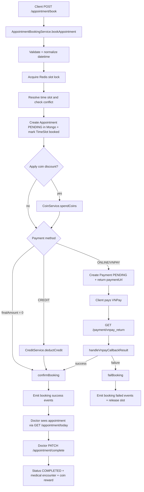
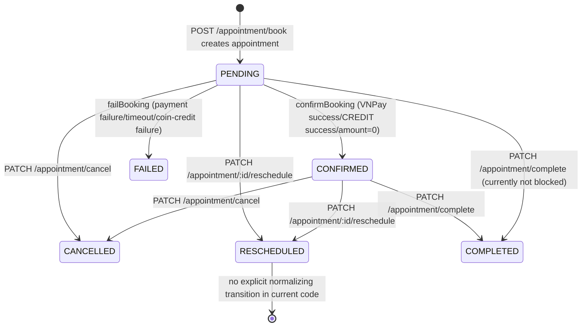

# Appointment Booking Module - Current End-to-End Flow

This document describes the **current implementation** of appointment booking in the backend.

Purpose:
- Help developers understand the current booking flow end-to-end.
- Provide a baseline for upcoming refactor phases.

Scope:
- Booking creation (`/appointment/book`)
- Payment branches (ONLINE/VNPAY, CREDIT, and coin discount)
- Booking confirmation/failure
- Doctor examination and completion
- Cancellation/refund side effects
- Events, notifications, sockets, and state transitions

## 1. Overview

### 1.1 What the module does

The booking module receives appointment requests from authenticated patients, reserves doctor slots, creates appointment records, and finalizes booking based on payment outcome.

### 1.2 Main components

- API layer
  - `src/appointment/appointment.controller.ts`
  - `src/payment/vnpay/vnpay-payment.controller.ts`
- Core services
  - `src/appointment/appointment-booking.service.ts`
  - `src/appointment/appointment.service.ts`
  - `src/appointment/appointment-reschedule.service.ts`
- Persistence models
  - `src/appointment/schemas/appointment.schema.ts`
  - `src/payment/schemas/payment.schema.ts`
  - Wallet models used via `CoinService` and `CreditService`
- External systems
  - Redis lock via `RedisService` for slot lock (`slot:{doctorId}:{timeSlotId}`)
  - VNPay via `VnPayPaymentService`
  - RabbitMQ notification jobs (`notification.jobs`)
  - Socket namespaces (`/appointment`, `/payment/vnpay`, `/notification`)

### 1.3 Data model highlights

Appointment currently stores:
- `scheduledAt` (source of truth, UTC epoch ms)
- `date` (deprecated compatibility alias)
- `startTime`, `endTime` (slot snapshot in UTC epoch ms)
- `appointmentStatus` in enum: `PENDING | CONFIRMED | FAILED | CANCELLED | COMPLETED | RESCHEDULED`
- payment snapshot fields: `paymentAmount`, `paidAt`, `paymentResponseCode`, `paymentTransactionStatus`

## 2. End-to-End Booking Flow

## 2.1 Sequence (high level)



## 2.2 Step-by-step details

### Step A: Client sends booking request

- Endpoint: `POST /appointment/book`
- Guard: `JwtAuthGuard`
- Handler: `AppointmentController.bookAppointment`
- Input DTO: `AppointmentBookingRequestDto`
- Identity source:
  - `patientEmail` from `req.user.email`
  - `patientId` from `req.user.patientId`

State changes:
- None yet.

### Step B: Backend validates and prepares booking

- Service: `AppointmentBookingService.bookAppointment`
- Key logic:
  - Validate required fields (`doctor.id`, `timeSlotId`, `hospitalName`, `serviceType`, `paymentMethod`, patient context)
  - Reject `paymentMethod=COIN` as direct payment (deprecated)
  - Parse/normalize datetime (`appointmentDate` required; fallback to `date` for backward compatibility)
  - Compute epoch fields with timezone-safe helper (`TimeHelper`, `AppointmentTimeHelper`)

State changes:
- None yet.

### Step C: Lock and conflict prevention

- Service: `AppointmentBookingService.bookAppointment`
- Key logic:
  - Acquire Redis lock: `slot:{doctorId}:{timeSlotId}` with TTL `BOOKING_PENDING_TTL_SECONDS`
  - Resolve target `TimeSlotLog` (`start`, `end`)
  - Compute `scheduledAt/startTime/endTime`
  - Query conflicting appointments (statuses `PENDING` or `CONFIRMED`)

State changes:
- Redis key is created for lock if successful.

### Step D: Create appointment in DB

- Service: `createAppointmentWithTransaction`
- Key logic:
  - Mongo transaction:
    - Insert appointment with status `PENDING`
    - Persist snapshot times and amount fields
    - Mark `TimeSlotLog.status='booked'`

State changes:
- Mongo `appointments`: new record with `PENDING`
- Mongo `timeslotslog`: selected slot marked `booked`

### Step E: Apply coin discount (optional)

- Service: `calculateBookingAmounts` + `CoinService.spendCoins`
- Key logic:
  - Discount is capped by rate and cap (`10%`, `30000` default in service)
  - FEFO coin allocation is persisted
  - If coin spend fails, booking transitions to failed path

State changes:
- Mongo coin wallet/coin transactions/coin allocations updated on success.

### Step F1: ONLINE/VNPAY branch

- Service: `handleOnlinePayment`
- Key logic:
  - Create `Payment` record (`status=PENDING`, unique by `appointmentId`)
  - Generate VNPay URL via `PaymentService.createPaymentUrl`
  - Emit `appointment.booking.pending`
  - Return `ResponseCode.PENDING` with `paymentUrl`

State changes:
- Mongo `payments`: one pending payment
- Event bus: `appointment.booking.pending`
- Redis slot lock remains until callback success/failure or expiration

### Step F2: CREDIT branch

- Service: `handleCreditPayment`
- Key logic:
  - Deduct credit from wallet
  - On success call `confirmBooking`
  - On failure call `failBooking`

State changes:
- Mongo credit wallet + credit transaction (debit)
- Appointment status updated to `CONFIRMED` on success, or `FAILED` on failure

### Step F3: Zero final amount branch

- Service: `confirmBooking`
- Trigger condition: `finalAmount === 0`
- Key logic:
  - Confirm directly without VNPay/Credit

State changes:
- Appointment status `PENDING -> CONFIRMED`
- Release slot lock (slot remains booked)
- Emit success events

### Step G: VNPay callback / confirmation

- Endpoint: `GET /payment/vnpay_return`
- Handler: `VnPayPaymentController.vnpayReturn`
- Key logic:
  - Verify checksum and parse callback
  - Call `AppointmentBookingService.handleVnpayCallbackResult`
  - Emits `payment.update` for socket/notification side effects

Success path state changes:
- Appointment `PENDING -> CONFIRMED`
- Payment metadata persisted into appointment (`paidAt`, `paymentResponseCode`, `paymentTransactionStatus`)
- Redis slot lock released
- Emits `appointment.booking.success`

Failure path state changes:
- Appointment `PENDING -> FAILED`
- Time slot set back to `available`
- Redis slot lock released
- Emits `appointment.booking.failed`

### Step H: Booking confirmation fanout

- Listener: `BookingListener`
- On `appointment.booking.success` emits:
  - `notify.patient.booking.success`
  - `notify.doctor.booking.success`
  - `mail.patient.booking.success`
  - `mail.doctor.booking.success`
  - `socket.appointment.success`
  - `doctor.update-schedule`

State changes:
- Notification jobs enqueued to RabbitMQ via notification listeners
- Socket pushes on `/appointment` namespace
- Shift service receives doctor schedule update event

### Step I: Doctor receives and processes booking

- Doctor fetch endpoint: `GET /appointment/today` (JWT doctor)
- Doctor complete endpoint: `PATCH /appointment/complete`

See Section 4 for details.

### Step J: Booking completion

- Service: `AppointmentService.completeAppointment`
- Key logic:
  - Set slot status `completed`
  - Set appointment status `COMPLETED`
  - Create medical encounter + mapped prescriptions
  - Reward coin (`rewardCoinForCompletedAppointment`, idempotent)

State changes:
- Appointment status `-> COMPLETED`
- TimeSlotLog status `-> completed`
- Medical encounter inserted
- Coin wallet/transaction update if reward applies

## 3. DTO Breakdown

This section covers request/response/event DTOs used in current booking/examination flow.

## 3.1 Request DTOs

### 3.1.1 `AppointmentBookingRequestDto`

Source: `src/appointment/dto/appointment-booking.dto.ts`

```ts
class AppointmentBookingRequestDto {
  hospitalName: string;
  appointmentDate: string;
  bookingDate?: string;
  date?: string; // deprecated
  specialty?: string;
  timeSlotId: string;
  doctor: DoctorDto | null;
  serviceType: ServiceType;
  paymentMethod: PaymentMethodEnum;
  amount?: number;
  reasonForAppointment: string;
  coinsToUse?: number;
  useCoin?: boolean;
}
```

Properties:
- `hospitalName`
  - Meaning: target clinic/hospital label in appointment.
  - Source: client payload.
  - Validation: `IsString`.
  - Usage: persisted to appointment and used in notifications/mail.
- `appointmentDate`
  - Meaning: scheduled visit datetime.
  - Source: client payload.
  - Validation: required, must be ISO with timezone (`IsIsoWithTimezone`).
  - Usage: converted to UTC epoch; drives `scheduledAt/startTime/endTime`.
- `bookingDate`
  - Meaning: booking request creation timestamp.
  - Source: client payload (optional).
  - Validation: optional ISO with timezone.
  - Usage: persisted as `bookingDate`; falls back to server `Date.now()`.
- `date` (deprecated)
  - Meaning: legacy alias for appointment date.
  - Source: legacy clients.
  - Validation: optional ISO with timezone.
  - Usage: fallback if `appointmentDate` missing.
- `specialty`
  - Meaning: specialty reference.
  - Source: client payload.
  - Validation: optional string.
  - Usage: persisted as `specialtyId`.
- `timeSlotId`
  - Meaning: selected slot id.
  - Source: client payload.
  - Validation: `IsMongoId`.
  - Usage: lock key, conflict check, slot status updates.
- `doctor`
  - Meaning: selected doctor summary (`id/name/email`).
  - Source: client payload.
  - Validation: nested DTO.
  - Usage: doctor id used for lock and appointment creation.
- `serviceType`
  - Meaning: service category.
  - Source: client payload.
  - Validation: enum `ServiceType`.
  - Usage: persisted and displayed downstream.
- `paymentMethod`
  - Meaning: payment route.
  - Source: client payload.
  - Validation: enum `PaymentMethodEnum`.
  - Usage: branch to ONLINE/VNPAY/CREDIT.
- `amount`
  - Meaning: original consultation amount.
  - Source: client payload.
  - Validation: optional number.
  - Usage: consultation fee and discount/final calculations.
- `reasonForAppointment`
  - Meaning: patient reason.
  - Source: client payload.
  - Validation: optional string (decorated optional despite non-optional type).
  - Usage: persisted and shown for doctor.
- `coinsToUse` / `useCoin`
  - Meaning: discount preference.
  - Source: client payload.
  - Validation: optional number/boolean.
  - Usage: coin discount calculation and spending.

### 3.1.2 `DoctorDto`

```ts
class DoctorDto {
  id: string;
  name: string;
  email: string;
}
```

Usage:
- Input helper payload from client; only `id` is required by booking logic.

### 3.1.3 `AppointmentBookingDto`

```ts
class AppointmentBookingDto extends AppointmentBookingRequestDto {
  patientEmail: string;
  patientId: string;
}
```

Properties added by backend controller:
- `patientEmail` and `patientId`
  - Source: JWT user context.
  - Validation: `IsEmail`, `IsMongoId`.
  - Usage: persisted + wallet operations + notifications.

### 3.1.4 `CompleteAppointmentDto`

```ts
class CompleteAppointmentDto {
  appointmentId: string;
  diagnosis: string;
  note?: string;
  prescriptions: PrescriptionItemDto[];
}
```

Usage:
- Input for `PATCH /appointment/complete`.
- Drives appointment completion and medical encounter creation.

### 3.1.5 `PrescriptionItemDto`

```ts
class PrescriptionItemDto {
  medicineId?: string;
  name: string;
  quantity: number;
  note: string;
}
```

Usage:
- For each prescription row, service maps/normalizes medicine and quantity.

### 3.1.6 `AppointmentRescheduleDto`

```ts
class AppointmentRescheduleDto {
  appointmentId: string;
  appointmentDate: string;
  timeSlotId: string;
  reason?: string;
}
```

Usage:
- Input for `PATCH /appointment/:id/reschedule`.
- Reschedule sets status to `RESCHEDULED` in current logic.

## 3.2 Response DTO Shapes (current practical contracts)

There is no strict class DTO for all responses; most booking endpoints return `DataResponse`-style objects.

### 3.2.1 Booking create (`POST /appointment/book`)

Success-pending (ONLINE/VNPAY):

```json
{
  "code": "PENDING",
  "message": "Appointment created. Complete payment to confirm booking.",
  "data": {
    "appointmentId": "...",
    "paymentUrl": "https://...",
    "originalAmount": 300000,
    "discountAmount": 30000,
    "finalAmount": 270000
  }
}
```

Success-confirmed (CREDIT or zero final):

```json
{
  "code": "SUCCESS",
  "message": "Appointment confirmed successfully",
  "data": {
    "appointmentId": "...",
    "originalAmount": 300000,
    "discountAmount": 0,
    "finalAmount": 300000
  }
}
```

Failure shape:

```json
{
  "code": "ERROR",
  "message": "Slot already booked",
  "data": {
    "originalAmount": 300000,
    "discountAmount": 0,
    "finalAmount": 300000
  }
}
```

### 3.2.2 Payment status (`GET /payment/:orderId` and `/payments/:orderId`)

```json
{
  "orderId": "...",
  "status": "PENDING|COMPLETED|FAILED",
  "amount": 270000,
  "paidAt": "2026-..." 
}
```

### 3.2.3 Complete appointment (`PATCH /appointment/complete`)

```json
{
  "code": "SUCCESS",
  "message": "Appointment completed and encounter stored",
  "data": {
    "appointmentId": "...",
    "patientId": "...",
    "encounterId": "..."
  }
}
```

## 3.3 Event DTOs / payloads in booking flow

### 3.3.1 `AppointmentEnriched` (`appointment.booking.success/pending`)

Source: `src/appointment/schemas/appointment-enriched.ts`

```ts
type AppointmentEnriched = Appointment & {
  appointmentId: string;
  doctorName: string | null;
  doctorEmail: string | null;
  patientName: string;
  patientEmail: string;
  amount: number;
  paymentStatus: PaymentStatusEnum;
  paidAt: Date;
  hospitalName: string;
}
```

Usage:
- Fanout payload for notify/mail/socket and shift update on booking success.

### 3.3.2 Booking failed event payload

```ts
{
  appointmentId?: string;
  patientEmail?: string;
  reason?: string;
}
```

Usage:
- Triggers patient notify/mail/socket failure events.

### 3.3.3 Cancellation payload (`notify/mail/socket patient appointment cancelled`)

```ts
{
  appointmentId: string;
  patientEmail: string;
  doctorEmail?: string;
  doctorName?: string;
  date: string;
  scheduledAt: number;
  timeSlot: string;
  timeSlotLabel?: string;
  hospitalName?: string;
  reason?: string;
  refundAmount?: number;
  refundReason?: string;
  shouldRefund?: boolean;
  status: "CANCELLED";
}
```

Usage:
- Built in cancel service and emitted to notification/mail/socket channels.

### 3.3.4 Unified notification envelope (`NotificationPayload`)

Source: `src/notification/dto/notification-payload.dto.ts`

```ts
type NotificationPayload = {
  type: 'COIN_EXPIRY_REMINDER' | 'APPOINTMENT_SUCCESS' | 'APPOINTMENT_CANCELLED' | 'PAYMENT_SUCCESS';
  data: unknown;
  createdAt: number;
  recipientEmail: string;
  idempotencyKey: string;
  retryCount?: number;
}
```

Usage:
- Produced by listeners -> published to RabbitMQ -> consumed and persisted -> published to Redis -> delivered over socket `/notification` as `NOTIFICATION_RECEIVED`.

## 4. Doctor Examination Flow

## 4.1 How doctor receives booking

Real-time and polling both exist:
- Real-time:
  - Booking success emits `socket.appointment.success`.
  - `AppointmentGateway` pushes `APPOINTMENT_BOOKING_SUCCESS` to doctor room (`doctorEmail`) and patient room.
- Polling/API:
  - Doctor calls `GET /appointment/today`.
  - Service returns doctor appointments filtered by day range using `scheduledAt` fallback to `date`.

## 4.2 Examination lifecycle update

- API: `PATCH /appointment/complete`
- Handler: `AppointmentController.completeAppointment`
- Service: `AppointmentService.completeAppointment`

Executed logic:
- Load appointment and slot.
- Set `timeSlot.status='completed'`.
- Set `appointment.appointmentStatus='COMPLETED'`.
- Persist medical encounter with diagnosis, note, prescriptions.
- Reward coin for completed appointment (idempotent by appointment).

## 4.3 Related APIs/events for doctor workflow

- `GET /appointment/today` (doctor workload for current day)
- `GET /appointment/completed/doctor` (doctor historical completed appointments)
- Event side effect after booking confirmation:
  - `doctor.update-schedule` -> `ShiftListener` -> `ShiftService.handleDoctorUpdateSchedule`

## 5. State Transitions

## 5.1 Current statuses

From `AppointmentStatus`:
- `PENDING`
- `CONFIRMED`
- `FAILED`
- `CANCELLED`
- `COMPLETED`
- `RESCHEDULED`

## 5.2 Transition graph in current implementation



Notes:
- There is no explicit `IN_PROGRESS` status in current implementation.
- `PATCH /appointment/complete` does not currently enforce `CONFIRMED` prerequisite.

## 6. Known Issues / Limitations

These are implementation-level observations from current code.

1. Authorization gaps on sensitive actions
- `PATCH /appointment/complete` has no JWT guard.
- `PATCH /appointment/:id/confirm` has no JWT guard.
- `PATCH /appointment/cancel` is guarded, but service does not validate ownership/role against `req.user`.

2. Reschedule status can create dead-end state
- Reschedule sets appointment to `RESCHEDULED`.
- Cancel currently allows only `PENDING` or `CONFIRMED`.
- Confirm endpoint allows only `PENDING`.
- This can leave `RESCHEDULED` appointments outside normal cancellation/confirmation transitions.

3. Inconsistent event wiring
- `AppointmentListenner` (handles `appointment.get.byId`) exists but is not registered in `AppointmentModule` providers.
- `PaymentNotificationListener` relies on `appointment.get.byId`; this may break payment-success notifications depending on module wiring/runtime.

4. Payment record and appointment payment state are loosely coupled
- VNPay callback updates appointment state and emits `payment.update`.
- Existing `Payment` document status is not updated in the callback path.
- Effective payment truth is inferred from appointment status rather than payment table status.

5. Duplicate timeslot update pathways
- Booking transaction sets `TimeSlotLog.status='booked'` directly.
- Booking success also emits `doctor.update-schedule` consumed by shift service.
- Multiple components touching slot/schedule can increase coupling and make invariants harder to reason about.

6. Mixed/legacy time fields still present
- `date` is deprecated but still used in fallback queries and unique index.
- Conflict checks and queries include migration-era fallbacks, increasing complexity and room for drift.

7. Error handling inconsistency in controller
- `rescheduleAppointment` and `cancelAppointment` catch and rethrow generic `Error`, which can lose HTTP-specific exception semantics.

8. Typing inconsistencies
- `reasonForAppointment` is typed required but decorated optional in DTO.
- Comments indicate `patientId` confusion in schema/service (“account Id, not patient Id”).

9. Side-effect fanout is synchronous event-emitter heavy
- Booking success/failure trigger many in-process events (notify/mail/socket/shift).
- Without stronger transactional outbox or queue boundary for all fanout, partial side effects are possible on runtime failures.

## 7. Notes for Refactor

Priority recommendations for maintainability and decoupling:

1. Enforce strict auth + ownership rules
- Require JWT + role checks for complete/confirm/cancel/reschedule.
- Validate that patient/doctor can only act on permitted appointments.

2. Normalize lifecycle states
- Introduce explicit flow, e.g. `PENDING -> CONFIRMED -> IN_PROGRESS -> COMPLETED`.
- Define where `RESCHEDULED` fits (transient marker or terminal event log) to avoid dead-end transitions.

3. Consolidate slot state ownership
- Pick one authoritative component for slot status mutation.
- Remove duplicate booking-side and shift-side slot updates or define clear ordering/invariants.

4. Separate payment domain state cleanly
- Keep `Payment` as source of payment truth and update it on callback.
- Map appointment status from payment/result rules, not vice versa.

5. Remove legacy date fallback in bounded rollout
- Complete migration to `scheduledAt/startTime/endTime` only.
- Remove `date` from conflict and filtering once backfill is guaranteed.

6. Stabilize event boundaries
- Move critical fanout to queue-backed workers consistently (not only notifications).
- Add idempotency keys for booking success/failure side effects where missing.

7. Harden API contracts
- Align DTO TypeScript optionality with validator decorators.
- Publish explicit response DTO classes for booking, payment status, cancellation, completion.

8. Improve observability and race protection
- Add structured logs around lock acquisition/release and transitions.
- Add metrics for pending timeout, callback failures, duplicate payment attempts, and lock contention.

## 8. Quick Endpoint Index (current)

Booking/payment core:
- `POST /appointment/book`
- `GET /payment/create_payment_url`
- `GET /payment/vnpay_return`
- `GET /payment/:orderId`
- `GET /payments/:orderId`

Doctor examination related:
- `GET /appointment/today`
- `PATCH /appointment/complete`
- `GET /appointment/completed/doctor`

Lifecycle operations:
- `PATCH /appointment/:id/confirm`
- `PATCH /appointment/cancel`
- `PATCH /appointment/:id/reschedule`

---

This document reflects the current implementation as of 2026-04-27 and should be updated together with any booking/payment/lifecycle behavior changes.
